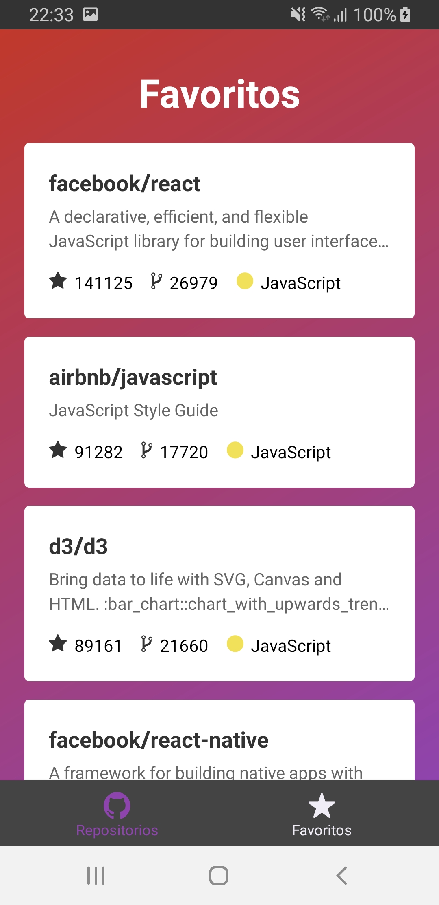
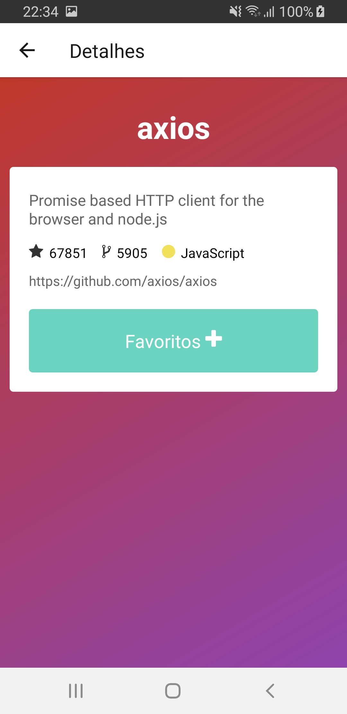

<p align="center">
  <h3 align="center">App Git Trends - react-native</h3>
</p>
<br />
<p>
  
  
  
</p>


## Sobre o Projeto

Neste projeto utilizei React Native, para gerar um app de Trends de repositorios do GitHub.

### Feito Com

Abaixo segue o que foi utilizado na criação deste template:

- React Native
- React Navigation
- React Native Gesture Handler
- Axios
- Reactotron
  - reactotron-react-native
- Babel
  - babel-eslint
  - babel-plugin-root-import
- Eslint
  - eslint-config-airbnb
  - eslint-plugin-import
  - eslint-plugin-jsx-a11y
  - eslint-plugin-react
  - eslint-plugin-react-native
  - eslint-import-resolver-babel-plugin-root-import
- EditorConfig
- Apollo
- GraphQL
- Realm
- Styled-components


### Instalação

1. Para instalar e utilizar o processo é bem simples, basta digitar o comando:

```sh
yarn install
```

2.  Executar os comandos separados
```sh
yarn start
react-native run-android
---

