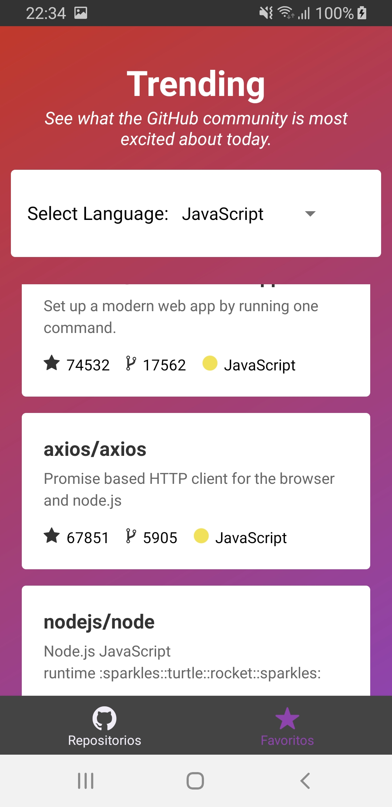

<p align="center">
  <h3 align="center">App Git Trends - react-native</h3>
</p>
<br />
<p>
  
  
  
</p>


## About in project

Application developed with React Native, Graphql, Apolo, Axios.

### Libraries used

List of libraries used in project development:

- React Native
- React Navigation
- React Native Gesture Handler
- Axios
- Reactotron
  - reactotron-react-native
- Babel
- Eslint
- EditorConfig
- Apollo
- GraphQL
- Realm
- Styled-components
- React Native dotenv


### Install

1. Enter command to install dependencies:

```sh
yarn install
```

2.  Configure Key of GitHub
  -  Access file .env and change key value
  * 1 - https://github.com/settings/tokens
  * 2 - Personal access tokens
  * 3 - Generate a personal access token

  HELP: https://help.github.com/en/github/authenticating-to-github/creating-a-personal-access-token-for-the-command-line

3.  Enter command
```sh
yarn start
```

And

```sh
// For Android
react-native run-android
// FOr IOS
react-native run-ios
```
